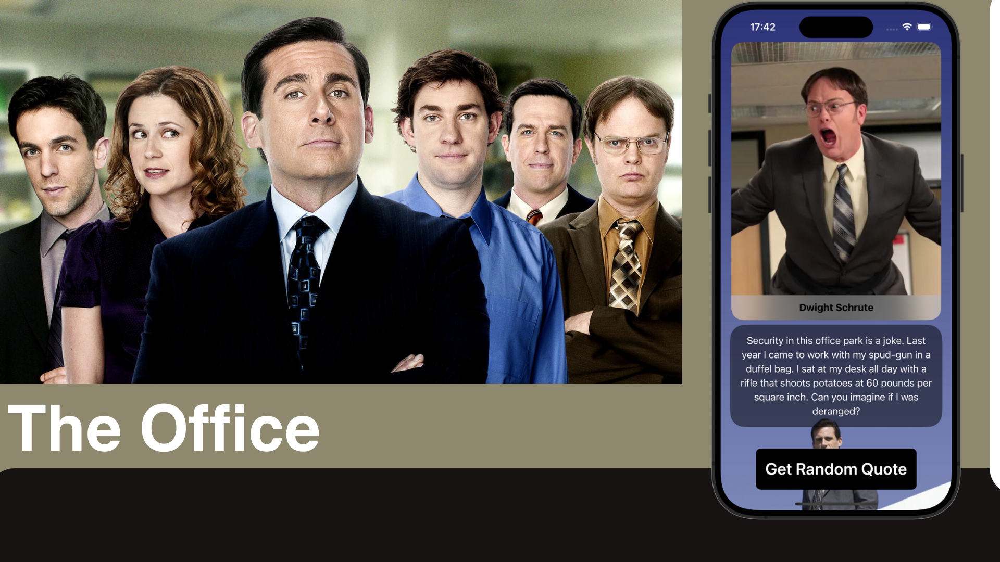

# The Office Quotes

## Description

This little project is to showcase practice getting data from an API and using it in an app. In that case, the user can display random quotes from the famous TV show: The Office (american version).

## Features

- **Get Random Quotes**: You can tap on a button and display a quote from that show: you will also see an image of the character who said it and their name.

## Stretch Goals

- **None for now...

## Technologies Used

- SwiftUI: A modern framework for building user interfaces across all Apple platforms.
- Xcode: An integrated development environment (IDE) for macOS containing a suite of software development tools.
- Swift: A powerful and intuitive programming language for macOS, iOS, watchOS, and tvOS development.

## Credits

- This project is partly inspired by [BBQuotes](https://github.com/alcode111/SwiftUIBBQuotes).
- **API**: The API used in this project can be found here: https://akashrajpurohit.github.io/the-office-api/

## Author

- [alcode111](https://github.com/alcode111)
